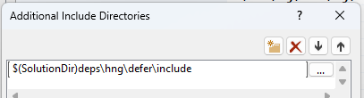

# defer
C++ header only library for deferred execution, useful for resource cleanup, ad-hoc RAII, and propagating exceptions from the deferred code block.

## Installation
This is a header only library. Copy the file `hng/defer/include/hng/defer/defer.h` into your project dependencies.

For example, in Visual Studio on Windows

1. Create a new C++ console application.

2. Open Windows Explorer, open the root directory of the solution, and create a new directory "`deps`"

3. Copy the `hng/defer/include` folder to `$(SolutionDir)deps\hng\defer\include`

4. In Visual Studio | Solution Explorer | right click the C++ project | Properties | C/C++ | Additional Include Directories | &lt;Edit...&gt;

    

5. Add the `include` folder.

    ```
    $(SolutionDir)deps\hng\defer\include
    ```

    

6. Include the header file.

    ```cpp
    #include <iostream>
    #include <assert>
    #include <hng/defer/defer.h>

    int main() {
        int* raw_ptr = new int(5);
        HNG_DT_DEFER_FINALLY [&]
        {
            std::cout << "finally block" << std::endl;
            delete raw_ptr;
            raw_ptr == nullptr;
        }
        HNG_DT_TRY [&]
        {
            std::cout << "try block" << std::endl;
        }
        HNG_DT_END;
        assert(raw_ptr == nullptr);
        return 0;
    }
    ```

## Examples

### HNG_DT DEFER_FINALLY/TRY/END macros

```cpp
HNG_DT_DEFER_FINALLY [&]
{
    // This closure is always invoked,
    // regardless of an exception thrown from the TRY block.
    // If this block throws an exception, this block's exception is propagated
    // and the TRY block's exception will be lost.
}
HNG_DT_TRY [&]
{
    // Even if this block throws an exception, the DEFER block is executed.
}
HNG_DT_END;
```

There can be nested blocks.

```cpp
HNG_DT_DEFER_FINALLY [&]
{
    HNG_DT_DEFER_FINALLY [&]
    {
        // 3. this executes third
    }
    HNG_DT_TRY [&]
    {
        // 2. this executes second
    }
    HNG_DT_END;
}
HNG_DT_TRY [&]
{
    // 1. this executes first
}
HNG_DT_END;
```

HNG_DT_END must be followed by a semicolon.

The try block may return a value, because the HNG_DT construct is an expression.

```cpp
int x = 0;
int y = 1;
y = HNG_DT_DEFER_FINALLY [&]
{
    // executed after the return statement in the try block.
    x = y;
}
HNG_DT_TRY [&]
{
    return 2;
}
HNG_DT_END;
assert(x == 1 && y == 2);
```

### defer class

```
hng::defer<TCallable>
```

#### C++17 Example

```cpp
int* raw_ptr = new int(5);
auto const my_defer = hng::defer([&]()noexcept{
    delete raw_ptr;
    raw_ptr = nullptr;
});
// ... do stuff with raw_ptr ...
```

#### C++11 Example
```cpp
int* raw_ptr = new int(5);
auto const my_callable = [&]()noexcept{
    delete raw_ptr;
    raw_ptr = nullptr;
};
hng::defer<decltype(my_callable)> const my_defer(my_callable);
// ... do stuff with raw_ptr ...
```

### HNG_DEFER BEGIN/END macros
(C++17)

```cpp
int* raw_ptr = new int(5);
HNG_DEFER_BEGIN
{
    delete raw_ptr;
    raw_ptr = nullptr;
}
HNG_DEFER_END;
// ... do stuff with raw_ptr ...
```

### HNG_DEFER_BLOCK macro

```cpp
int* raw_ptr = new int(5);
HNG_DEFER_BLOCK({
    delete raw_ptr;
    raw_ptr = nullptr;
});
// ... do stuff with raw_ptr ...
```

### HNG_DEFER_NAMED BEGIN/END macros

```cpp
int* raw_ptr = new int(5);
HNG_DEFER_NAMED_BEGIN(my_name)
{
    delete raw_ptr;
    raw_ptr = nullptr;
}
HNG_DEFER_NAMED_END(my_name);
// ... do stuff with raw_ptr ...
```

### HNG_DEFER_CALLABLE_VARIABLE macro

```cpp
int* raw_ptr = new int(5);
auto my_callable = [&]()noexcept{
    delete raw_ptr;
    raw_ptr = nullptr;
};
HNG_DEFER_CALLABLE_VARIABLE(my_callable);
// ... do stuff with raw_ptr ...
```

## Running the Tests

```
cd build/
cmake ..
```

2. Open the Visual Studio solution `.sln` that was generated at `build/defer_tests.sln`.

3. In the Solution Explorer, right click `defer_tests` | Set as Startup Project

4. Debug | Start Debugging (F5)

## Compatibility

This has been tested on Windows with Visual Studio MSVC compiler with standard C++11 language version and above.

PR's are welcome; we're looking for instructions on how to get started using g++, clang; on linux, mac.
